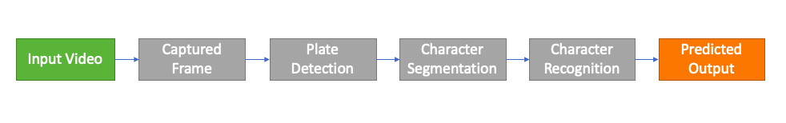
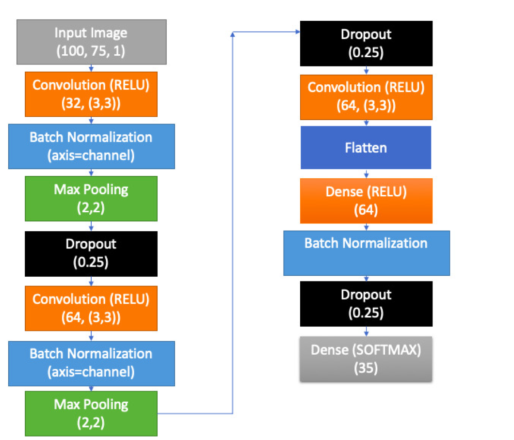
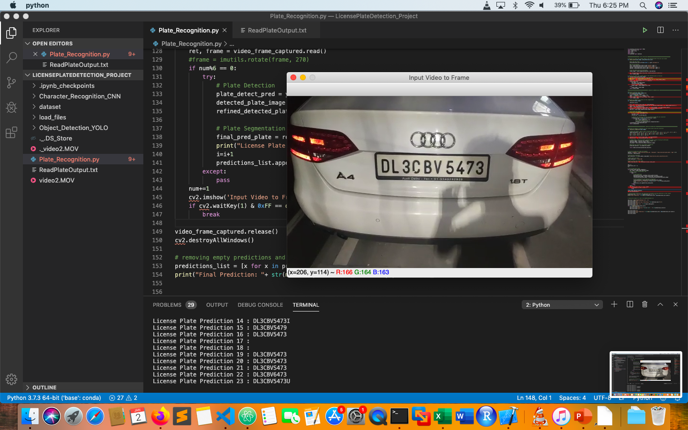
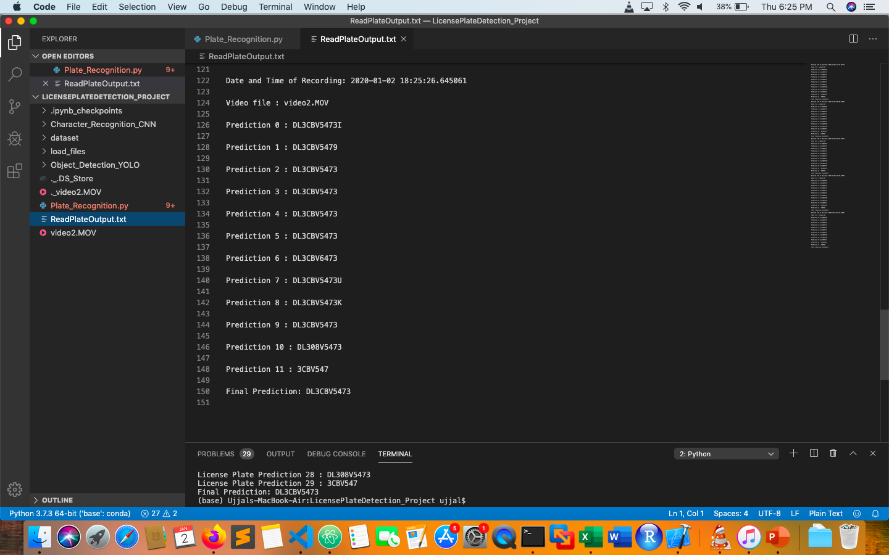

# AutoScan

AutoScan is a License Plate Detection and Recognition System which takes a video input and detects a license plate using YOLO and then recognizes the number in the License Plate by using a CNN classifier and gives the output.
The whole project pipeline is explained by the diagram below


## Plate Detection (YOLO)
The plate detection part is done using YOLOv2.
The weights and .cfg file was downloaded and the .cfg file was edited as per our requirement. Since the number of classes in our case is 1 which is just 'plates', we have changed the number accordingly and also changed the number of filters in the last convolutional layer accordingly to 30 (no. of filters in last conv. layer = (5 + no. of classes) * 5 ).
The model was then trained on top of our car images and annotated data and the model (and weights) were saved in .pb (protobuf) file. The training code and .cfg can be found in the 'Object_Detection_Yolo' folder. The weights and trained .pb file can be found in the drive link given. The same file was then loaded in our main program 'AutoScan.py' to be used.
### Data preparation
The data of car images was crawled from web using the code in the 'data_prep_and_aug' folder. The same folder contains data augmentation code that was used to augment the images for generating a larger dataset. The plates were then annotated using LabelImg tool.

The labeled and annotations (in XML format) can be found in the drive link.

## Character Segmentation
The characters were segmented from the detected plate using OpenCV technique of finding contours after applying a set of transformations. Then it was passed on to a CNN classifier to predict the characters.

## Character Recognition
The character recognition is done using a CNN model. The model was trained by the code in the CNN_Classifier folder. And the .h5 file is then loaded in AutoScan.py file. The model is used for multiclass classfication of 35 classes of characters (10 Numeric (0-9) and 25 alphabets which excludes o since it is considered same as 0).
The CNN Model architicture is explained below.


## Running the program
To run the program, you need to have darknet and required libraries installed. Then run the AutoScan.py file. To run for a specefic video just edit the AutoScan.py file to add your video path to 'input_video_path' variable.
```
python AutoScan.py
```
The prgram will predict every 6th frame in the video and give a output. And the most common occuring prediction is stored as final output. Press q to stop the predicitions. All predictions and final output is printed in the terminal and also saved in ReadPlateOutput.txt file.


The drive link containing dataset and related files -  https://drive.google.com/open?id=15A7JBY7pDUCBPIT2-uDJcJG-2g6I0btN
